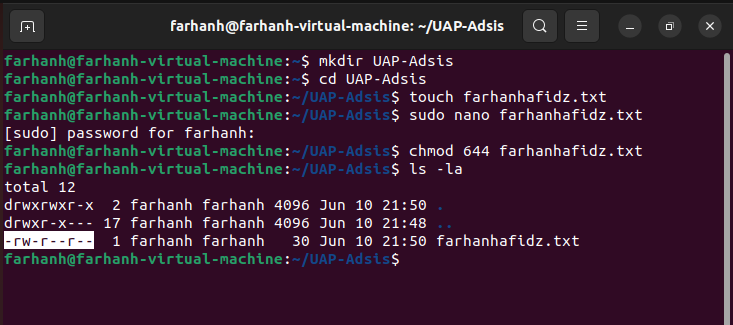

# UAP-Adsis_E
NO 1)
Menjalankan perintah 

Isi file farhanhafidz.txt

NO 2)
Mengkonfigurasi IP Address Sementara

NO 3)
Dikarenakan webmin sudah diinstall sebelumnya, maka langsung ke halaman webmin

Membuat User pada Webmin

Membuat Grup dan memasukkan user

Bukti user telah masuk grup

NO 4) Membuat konfigurasi reject and drop pada webmin

Menampilkan connection lost setelah apply configuration

Melakukan ping ke ip setelah reject and drop

NO 5)
Melakukan Perintah crontab -e untuk membuat perintah otomatis ping ke filkom.ub.ac.id setiap 4 menit

Setiap 4 menit menjalankan perintah ping secara otomatis

